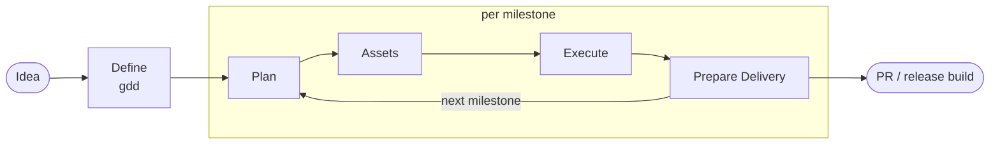

<h1 align="center">AI Agents for Unity</h1>

<p align="center"><b>Build Unity games with AI agents: one prompt in, a playable milestone out.</b></p>

<p align="center">
  <a href="https://img.shields.io"></a>
  
  
  <a href="https://github.com/ilezhnin/gamedev-ai-agents/actions/workflows/validate.yml"></a>
  
</p>

<p align="center">
  <b>English</b> | <a href="README.ru.md">Русский</a>
  &nbsp;&middot;&nbsp;
  <a href="#quick-start">Quick Start</a>
  &nbsp;&middot;&nbsp;
  <a href="#the-pipeline">Pipeline</a>
  &nbsp;&middot;&nbsp;
  <a href="#whats-inside">What's Inside</a>
  &nbsp;&middot;&nbsp;
  <a href="CHANGELOG.md">Changelog</a>
</p>

This kit turns your AI coding agent - OpenAI Codex, Anthropic Claude Code, Google Gemini CLI, or Google Antigravity - into a small game studio inside your Unity project. A game designer role writes the design contract, a planner slices it into playable milestones, workers implement, QA plays the build, reviewers audit the diff, and a release agent ships the PR. Run it stage by stage under your control, or fully automatic from a single prompt.

- **2-minute install** - add one git URL in Unity Package Manager, click Install, done.
- **Idea to playable** - `gdd` turns a one-line idea into a design contract; `game-pipeline` executes it through gated stages. Every milestone ends playable: compiles, PlayMode enters clean, the new mechanic is reachable in-game.
- **28 skills** for real gamedev work: behavior-preserving simplification, asset sourcing/generation, codebase audits, scene/prefab merges, EditMode/PlayMode tests, IL2CPP build triage, profiling with budgets, editor automation over MCP, staged upgrades.
- **A studio of roles** - game designer, asset specialists, producer, architect, QA, devops, plus workers, reviewers, and researchers - rendered natively for every platform.
- **Platform-independent by design** - one canon, thin rendered adapters. All state lives in repo files, so switching Codex <-> Claude Code <-> Gemini CLI <-> Antigravity mid-task loses nothing.
- **Safe lifecycle** - hash-manifest installs: updates refresh only unmodified files, your local edits always survive, uninstall removes exactly what the kit shipped.
- **Portable mode** - optional zero-trace installs: one root file (`AGENTS.md`), everything else under `.agents/`, `.claude/`, `.codex/`, `.gemini/`, `.cursor/`; a portable install git-excludes every kit file locally and the package reference itself can be removed, so nothing about the kit ever reaches your repo.

## Quick Start

**1. Install the package.** In Unity 2020.3+: `Window -> Package Manager -> + -> Add package from git URL...`

```text
https://github.com/ilezhnin/gamedev-ai-agents.git?path=/upm
```

Append `#v<tag>` to pin a version.

**2. Click Install.** The Agent Kit window opens automatically (or via `Window -> Agent Kit -> Setup`). It copies the project contracts, skills, roles, permissions, and hooks into your project root and records everything in a manifest.

**3. Make a game.** Restart your agent CLI (or open a new session from the project) and prompt:

```text
$gdd "cozy island farming sim, mobile, 5-minute sessions"   # Codex
/gdd "cozy island farming sim, mobile, 5-minute sessions"   # Claude Code
```

The `gdd` run researches the idea, grills the design with you, writes the contract, and stops - you choose how to execute:

```text
$game-pipeline           # one gated stage at a time, you approve each step
$game-pipeline auto      # the whole MVP from one prompt, stops only on blockers
```

Antigravity reads `AGENTS.md` and `.agents/skills/` natively - just describe what you want.

## The Pipeline



| Stage | Skills | Lead role | Gate to pass |
| --- | --- | --- | --- |
| Define | `gdd` | game-designer | Design contract grilled with the user and approved; milestones have acceptance criteria |
| Plan | `planning`, `grill-me` | planner | No unresolved blocking questions |
| Assets | `asset-pipeline` | asset-scout, asset-creator, unity-asset-integrator | Required placeholders or briefs exist; provenance/import risks recorded |
| Execute | `crossworking` -> `unity-implement`, `simplify-change`, `unity-validate`, `unity-review` | workers, validator, reviewer | Final candidate fingerprint has post-simplification check, validation, and review green |
| Prepare delivery | `create-mr`, `unity-build` only when explicitly requested | pr-submitter, devops | Authorized commit/push/PR/build uses the exact reviewed candidate |

Three modes: **stage** (default - run one stage, stop), **milestone** (Plan, Assets, and Execute for one named milestone), **auto** (loop milestones until the GDD's MVP checklist is done). Delivery actions run only when explicitly requested and authorized by repository policy. Pipeline state lives in `.agents/plans/pipeline.md`, the selected design contract in `.agents/plans/<slug>-gdd.md` - any agent on any platform resumes from files, never from chat memory.

Milestones are vertical slices: "player moves and jumps in a graybox level", never "input system done". Balance lives in data assets with tuning ranges, art starts as placeholders so implementation never blocks, and QA captures PlayMode evidence (console, screenshots) through the Unity editor via MCP.

## What's Inside

### Skills

Invocation: `$skill-name` in Codex, `/skill-name` or automatic matching in Claude Code - same names, same content everywhere.

Game pipeline:

| Skill | Purpose |
| --- | --- |
| `gdd` | Game design contract: core loop, mechanics, balance data, scope-boxed MVP, playable milestones |
| `asset-pipeline` | Source, generate, and integrate placeholder/concept/graybox assets with provenance |
| `game-pipeline` | Staged delivery over GDD milestones: define -> plan -> assets -> build -> test -> review -> ship; stage, milestone, and auto modes |

Unity (`unity-...`):

| Skill | Purpose |
| --- | --- |
| `unity-orient` | Map an unfamiliar Unity project: version, packages, asmdefs, tests, risks |
| `unity-implement` | Safe C# changes: serialization, lifecycle, script structure, boundaries |
| `unity-tests` | Bootstrap and author EditMode/PlayMode tests, humble-object refactors |
| `unity-debug` | Root-cause debugging: reproduce, localize, fix, guard; rendering triage |
| `unity-review` | Code-owner review of Unity diffs with severity/confidence classification |
| `unity-validate` | Cheapest sufficient validation: compile, EditMode, PlayMode, console |
| `unity-mcp` | Drive the Unity Editor through MCP: scenes, prefabs, tests, screenshots |
| `unity-merge` | Scene/prefab/asset merge conflicts: UnityYAMLMerge + manual YAML audit |
| `unity-build` | Player builds: batchmode, IL2CPP triage, Addressables ordering, CI |
| `unity-upgrade` | Staged editor/package upgrades with churn triage |
| `unity-profile` | Measure-first performance loop with numeric budgets |

Shared:

| Skill | Purpose |
| --- | --- |
| `planning` | Writes `.agents/plans/active_plan.md` + `task_list.md` before execution |
| `crossworking` | Verified handoff loop: baseline -> implement -> simplify -> candidate -> validate -> review |
| `simplify-change` | Behavior-preserving cleanup pass after implementation and before final validation/review |
| `arch-audit` | Module architecture audit -> dependency-ordered refactor backlog (SOLID/KISS/DRY, fallbacks, runtime authoring lens) |
| `codebase-audit` | Read-only whole-project issue audit with script-organization, overengineering, fallback, runtime-authoring, security, rollback, and determinism findings |
| `grill-me` | Relentless plan and design stress-testing before implementation |
| `create-mr` | Verify complete task diff; perform only authorized commit, push, or PR/MR actions |
| `learn` | Capture reusable lessons into AGENTS.md / learnings / skills |

C# backend (`backend-...`), for game servers and services: `backend-orient`, `backend-implement`, `backend-tests`, `backend-debug`, `backend-review`, `backend-validate` - same discipline, ASP.NET flavored, installed by the backend template.

### Roles

Canonical role contracts, rendered natively where the platform supports them (Codex agent TOMLs, Claude Code subagents, Antigravity orchestration rules):

- **Studio**: `game-designer` (owns the GDD), `asset-scout` / `asset-creator` / `unity-asset-integrator` (source, generate, and import milestone assets), `producer` (stage gates, scope cuts, pipeline state), `architect` (guards ARCHITECTURE.md, arbitrates boundaries), `qa` (acceptance + exploratory playtesting), `devops` (CI, batchmode builds, release discipline).
- **Delivery**: `planner`, `context-builder`, `unity-worker` / `backend-worker`, `unity-explorer` / `backend-explorer`, `unity-reviewer` / `backend-reviewer`, `unity-test-runner` / `backend-test-runner`, `oracle` (drift check on long tasks), `researcher`, `pr-submitter`.

Hierarchy rule: specialized stack roles implement, test, and review; broader-profile roles coordinate above them and never write production code.

### Project Contracts

The install places living contracts that keep agents on rails: `AGENTS.md` at the project root (tech stack, module map, boundaries, skill routing) and, under `.agents/`: `ARCHITECTURE.md` (module shape, boundary enforcement, determinism, serialization compatibility), `CODE_STYLE.md`, `DEPENDENCIES.md` (every package justified). `AGENTS.md` is the only root file the kit ships - discovery contracts of Codex, Cursor, and Antigravity require it there. Agents read the contracts before acting; `learn` keeps project lessons in `.agents/learnings.md`.

## Platforms

One canon, rendered adapters - `.codex/`, `.claude/`, and `.gemini/settings.json` are generated at install time and never edited by hand:

| Concern | Canon | Codex | Claude Code | Gemini CLI | Antigravity |
| --- | --- | --- | --- | --- | --- |
| Instructions | `AGENTS.md` + contracts | native | via `.claude/CLAUDE.md` pointer | shared files | native |
| Skills | `plugins/.../skills/` | `.agents/skills/` | `.claude/skills/` mirror | shared files | `.agents/skills/` native |
| Subagent roles | `canon/roles.json` | `.codex/agents/*.toml` | `.claude/agents/*.md` | not pinned | `.agents/rules/` (dynamic orchestration) |
| Permissions | `canon/permissions.json` | `.codex/rules/` | `.claude/settings.json` | not pinned | `.agents/rules/` (behavioral) |
| Hooks | `canon/hooks.json` | `.codex/hooks.json` | `.claude/settings.json` | `.gemini/settings.json` | `.agents/rules/` (behavioral) |
| Work state | `.agents/plans/`, `docs/` | shared | shared | shared | shared |

Role models are budgeted by capability tier: Codex renders Sol for architecture/design/planning/review and Terra for everyday execution/research, with Luna for repeatable test runners. Claude renders `claude-fable-5` for the highest-decision and reviewer roles, `sonnet` for execution/research/asset work, and `haiku` for test runners without an unsupported effort override. Routine roles stay bounded at `xhigh`, `high`, or `medium`; unconstrained `max`/`ultra` modes are explicit one-off escalations only. Gemini CLI and Antigravity receive shared project behavior, but the kit does not pin per-role model choices there.

Codex, Claude Code, and Gemini CLI get working hooks for the kit's `.meta`/GUID hygiene check after edits and usage reporting after a turn. Usage hooks write `.agents/usage/last-report.md`, platform-scoped reports, session-scoped reports, V2 events, and history; because some clients hide hook messages, installed `AGENTS.md` also requires agents to append visible usage stats from `.agents/scripts/usage-footer.ps1 -Platform <platform> -SessionId <exact-session-id>` to every final response. Without an exact session ID the footer fails closed as `Usage: unavailable` instead of showing a stale latest report. A commented `[mcp_servers.unity]` block in `.codex/config.toml` shows where to wire an [MCP for Unity](https://github.com/CoplayDev/unity-mcp) server - with it, `unity-mcp` and the pipeline's QA stage can drive the editor directly: scenes, PlayMode, tests, screenshots. Claude Code reads MCP servers from `.mcp.json`; a Cursor pointer rule ships too.

## Updating And Uninstalling

Bump the package in Package Manager - already-installed projects auto-apply the safe **Update** pass: files you have not modified are refreshed, local edits are kept, and files the kit no longer ships are removed. The Agent Kit window still offers manual **Update**, **Force Reinstall**, **Uninstall**, and **Dry run** preview. Script installs share the same manifest, so you can mix editor and script flows freely. Removing the package itself in Package Manager also offers to remove the installed kit files (same semantics: local edits are kept); only the window's **Remove Package Reference** deliberately leaves them in place.

**Portable install (no trace in the repo).** Do not want the kit in version control? Check **Portable install** in the Agent Kit window (or pass `-Portable` to the script installers): every kit file is listed in the repository's `.git/info/exclude` - a local ignore file that is itself never committed - so nothing appears in `git status` and `.gitignore` stays untouched. Later installs and updates refresh the entries automatically; uninstall removes them. **Remove Package Reference** then deletes the last committed trace, the package entry in `Packages/manifest.json` and the lock file - the installed kit files keep working, and re-adding the package restores update/uninstall. Note the flip side: your filled-in contracts (`AGENTS.md`, `.agents/ARCHITECTURE.md`, ...) stay local-only too, so teams that want shared contracts should commit those and keep portable mode off.

<details>
<summary><b>Other ways to install (PowerShell, backend template, global profile, plugin)</b></summary>

All scripted installers support `-Update`, `-Force`, `-Portable`, and `-WhatIf` with the same manifest semantics. The scripts target Windows (PowerShell 5.1 and pwsh 7); other platforms are currently out of scope.

**Unity project via script** (same result as the package window):

```powershell
powershell -NoProfile -ExecutionPolicy Bypass -File .\scripts\install-unity-project-template.ps1 -TargetProject "<path-to-unity-project>"
```

Installs the template contracts, the 22 Unity+shared skills into `.agents/skills/` and `.claude/skills/`, renders all platform adapters from the canon, and writes `.agents/kit-manifest.json`. The target must contain `Assets/` and `ProjectSettings/` (`-AllowNonUnityTarget` to override).

**C# ASP.NET backend project** (game servers, services):

```powershell
powershell -NoProfile -ExecutionPolicy Bypass -File .\scripts\install-csharp-aspnet-project-template.ps1 -TargetProject "<path-to-backend-project>"
```

Same shape: backend contracts, the 14 backend+shared skills, rendered adapters. The target must contain a `.sln`, `.slnx`, or `.csproj` (`-AllowNonDotnetTarget` to override).

**Global profile** (optional, engineering discipline for all projects):

```powershell
powershell -NoProfile -ExecutionPolicy Bypass -File .\scripts\install-global-profile.ps1
```

Installs the `unity-codex` profile into `~/.codex` (run `codex --profile unity-codex`). `-InstallAgentsMd` activates the full 18-section global discipline (existing file is backed up), `-InstallSkills` copies all 28 skills to user scope, `-InstallClaude` adds the Claude Code global layer, `-InstallWslSkills` covers Codex-under-WSL setups.

**Codex plugin marketplace**:

```powershell
codex plugin marketplace add "<path-to-this-kit>"
```

**Uninstall via script** (`-Global` removes the global profile from `~/.codex`, `~/.agents`, and `~/.claude` instead of a project):

```powershell
powershell -NoProfile -ExecutionPolicy Bypass -File .\scripts\uninstall-project-template.ps1 -TargetProject "<path>"
```

</details>

<details>
<summary><b>Utilities: doctor, kit self-lint, meta check</b></summary>

```powershell
# Environment health: git/gh/dotnet/UNITY_EDITOR/Unity Hub/YAMLMerge/kit version, with fix commands.
powershell -NoProfile -ExecutionPolicy Bypass -File .\scripts\doctor.ps1 -TargetProject "<path>"

# Kit self-lint: frontmatter, references, manifests, skill sets, canon rendering, docs paths, UPM payload drift, ASCII policy.
powershell -NoProfile -ExecutionPolicy Bypass -File .\scripts\validate-kit.ps1

# Unity meta/GUID hygiene (also installed into projects and wired as a post-edit hook).
powershell -NoProfile -ExecutionPolicy Bypass -File .\scripts\check-unity-meta.ps1 -ProjectRoot "<path>" -Full
```

`doctor.ps1` also reports when an installed project is behind the kit version or a rendered adapter layer drifted.

</details>

<details>
<summary><b>Repository layout (for contributors)</b></summary>

```text
AGENTS.md                  kit-repo editing rules and validation
VERSION / CHANGELOG.md     semver + release notes
global/
  AGENTS.md                full engineering discipline (global profile)
  unity-codex.config.toml  Codex profile
  canon/                   SINGLE SOURCE OF TRUTH: roles.json, permissions.json, hooks.json
templates/
  unity-project/           AGENTS.md (root); .agents/ ARCHITECTURE.md, CODE_STYLE.md,
                           DEPENDENCIES.md; .claude/CLAUDE.md, .cursor/, .codex/config.toml
  csharp-aspnet-project/   same shape for ASP.NET
plugins/
  codex-unity-agent-kit/   the plugin: 28 skills (single source of truth)
upm/                       Unity Package Manager wrapper: editor setup window +
                           pre-rendered payload in Kit~ (generated, never hand-edited)
.agents/plugins/           local marketplace pointing at the plugin
scripts/                   installers (render platform adapters from canon), update/uninstall,
                           render-upm-payload, validate-kit, doctor, check-unity-meta
```

How configuration layers in an installed project: global instructions (optional) -> project `AGENTS.md` + contracts -> rendered platform adapters (`.codex/`, `.claude/`) -> project-scope skills and learnings under `.agents/`.

Contributions: run `scripts\validate-kit.ps1` before committing; after changing templates, skills, or the canon, re-render the UPM payload with `scripts\render-upm-payload.ps1`. English only, ASCII in templates/plugins/upm.

</details>

## Security Notes

The kit never ships or copies: Codex/Claude auth files, API keys, OAuth tokens, machine-specific Unity license state, hook trust state. Keep secrets in environment variables, the OS keychain, or each platform's normal auth flow. Project hooks require trust review (`/hooks`) in Codex.

## Versioning

Semver in `VERSION`, releases in [CHANGELOG.md](CHANGELOG.md). Installed projects record their kit version in `.agents/kit-manifest.json`; `doctor.ps1` reports when a project is behind. MIT license.
