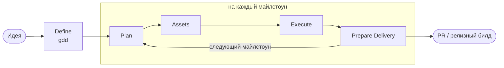

<h1 align="center">AI Agents for Unity</h1>

<p align="center"><b>Разработка игр в Unity с ИИ-агентами: на входе промпт, на выходе играбельный майлстоун.</b></p>

<p align="center">
  <a href="https://img.shields.io"></a>
  
  
  <a href="https://github.com/ilezhnin/gamedev-ai-agents/actions/workflows/validate.yml"></a>
  
</p>

<p align="center">
  <a href="README.md">English</a> | <b>Русский</b>
  &nbsp;&middot;&nbsp;
  <a href="#быстрый-старт">Быстрый старт</a>
  &nbsp;&middot;&nbsp;
  <a href="#пайплайн">Пайплайн</a>
  &nbsp;&middot;&nbsp;
  <a href="#что-внутри">Что внутри</a>
  &nbsp;&middot;&nbsp;
  <a href="CHANGELOG.md">Changelog</a>
</p>

Кит превращает вашего ИИ-агента - OpenAI Codex, Anthropic Claude Code, Google Gemini CLI или Google Antigravity - в маленькую игровую студию внутри Unity-проекта. Роль геймдизайнера пишет дизайн-контракт, планировщик режет его на играбельные майлстоуны, воркеры реализуют, QA играет в сборку, ревьюеры проверяют дифф, а релизный агент отправляет PR. Управляйте поэтапно вручную - или полностью автоматически из одного промпта.

- **Установка за 2 минуты** - один git URL в Unity Package Manager, кнопка Install, готово.
- **От идеи до играбельного** - `gdd` превращает идею в одну строку в дизайн-контракт; `game-pipeline` исполняет его через этапы с гейтами. Каждый майлстоун заканчивается играбельным состоянием: компилируется, PlayMode стартует чисто, новая механика доступна в игре.
- **28 скиллов** для реальной геймдев-работы: упрощение без изменения поведения, поиск и генерация ассетов, аудит кодовой базы, мерджи сцен и префабов, EditMode/PlayMode тесты, разбор IL2CPP-сборок, профилирование с бюджетами, автоматизация редактора через MCP, поэтапные апгрейды.
- **Студия ролей** - геймдизайнер, специалисты по ассетам, продюсер, архитектор, QA, devops, плюс воркеры, ревьюеры и исследователи - рендерятся нативно для каждой платформы.
- **Платформонезависимость by design** - один канон, тонкие рендеренные адаптеры. Всё состояние живёт в файлах репозитория, поэтому переключение Codex <-> Claude Code <-> Gemini CLI <-> Antigravity посреди задачи ничего не теряет.
- **Безопасный жизненный цикл** - установка по hash-манифесту: обновление трогает только немодифицированные файлы, ваши правки всегда выживают, деинсталляция удаляет ровно то, что ставил кит.
- **Портативный режим** - опциональная установка без следов: один файл в корне (`AGENTS.md`), остальное в `.agents/`, `.claude/`, `.codex/`, `.gemini/`, `.cursor/`; портативная установка локально исключает каждый файл кита из git, а ссылку на пакет можно убрать - в ваш репозиторий о ките не попадает ничего.

## Быстрый старт

**1. Установите пакет.** В Unity 2020.3+: `Window -> Package Manager -> + -> Add package from git URL...`

```text
https://github.com/ilezhnin/gamedev-ai-agents.git?path=/upm
```

Добавьте `#v<тег>`, чтобы зафиксировать версию.

**2. Нажмите Install.** Окно Agent Kit откроется само (или через `Window -> Agent Kit -> Setup`). Оно скопирует контракты проекта, скиллы, роли, разрешения и хуки в корень проекта и запишет всё в манифест.

**3. Делайте игру.** Перезапустите CLI агента (или откройте новую сессию из проекта) и напишите:

```text
$gdd "уютный фермерский симулятор на острове, мобилка, сессии по 5 минут"   # Codex
/gdd "уютный фермерский симулятор на острове, мобилка, сессии по 5 минут"   # Claude Code
```

`gdd` поресерчит идею, прожарит дизайн вместе с вами, запишет контракт и остановится - как исполнять, решаете вы:

```text
$game-pipeline           # по одному этапу с гейтами, каждый шаг под вашим контролем
$game-pipeline auto      # весь MVP из одного промпта, останавливается только на блокерах
```

Antigravity читает `AGENTS.md` и `.agents/skills/` нативно - просто опишите, что нужно.

## Пайплайн



| Этап | Скиллы | Ведущая роль | Гейт |
| --- | --- | --- | --- |
| Define | `gdd` | game-designer | Дизайн-контракт прожарен с пользователем и утверждён; у майлстоунов есть критерии приёмки |
| Plan | `planning`, `grill-me` | planner | Нет неразрешённых блокирующих вопросов |
| Assets | `asset-pipeline` | asset-scout, asset-creator, unity-asset-integrator | Нужные плейсхолдеры или брифы есть; provenance/import риски записаны |
| Execute | `crossworking` -> `unity-implement`, `simplify-change`, `unity-validate`, `unity-review` | воркеры, validator, reviewer | Финальный candidate fingerprint имеет post-simplification check, validation и review green |
| Prepare delivery | `create-mr`, `unity-build` только по явному запросу | pr-submitter, devops | Авторизованный commit/push/PR/build использует ровно reviewed candidate |

Три режима: **stage** (по умолчанию - один этап и стоп), **milestone** (Plan, Assets и Execute для одного указанного майлстоуна), **auto** (цикл по майлстоунам, пока не выполнен MVP-чеклист из GDD). Delivery-действия выполняются только по явному запросу и при совместимости с политикой репозитория. Состояние пайплайна живёт в `.agents/plans/pipeline.md`, выбранный дизайн-контракт - в `.agents/plans/<slug>-gdd.md`: любой агент на любой платформе продолжает работу из файлов, а не из памяти чата.

Майлстоуны - вертикальные срезы: «игрок ходит и прыгает в грейбокс-уровне», а не «система ввода готова». Баланс живёт в дата-ассетах с диапазонами тюнинга, арт начинается с плейсхолдеров, чтобы реализация не блокировалась, а QA собирает доказательства из PlayMode (консоль, скриншоты) через Unity-редактор по MCP.

## Что внутри

### Скиллы

Вызов: `$имя-скилла` в Codex, `/имя-скилла` или автоматический подбор в Claude Code - одни имена, один контент везде.

Игровой пайплайн:

| Скилл | Назначение |
| --- | --- |
| `gdd` | Дизайн-контракт игры: core loop, механики, баланс как данные, MVP в жёстких рамках, играбельные майлстоуны |
| `asset-pipeline` | Поиск, генерация и интеграция placeholder/concept/graybox ассетов с provenance |
| `game-pipeline` | Поэтапная доставка по майлстоунам GDD: define -> plan -> assets -> build -> test -> review -> ship; режимы stage, milestone и auto |

Unity (`unity-...`):

| Скилл | Назначение |
| --- | --- |
| `unity-orient` | Карта незнакомого Unity-проекта: версия, пакеты, asmdef, тесты, риски |
| `unity-implement` | Безопасные изменения C#: сериализация, лайфсайкл, структура скриптов, границы |
| `unity-tests` | Бутстрап и написание EditMode/PlayMode тестов, humble-object рефакторинги |
| `unity-debug` | Отладка до первопричины: воспроизвести, локализовать, починить, защитить; разбор проблем рендеринга |
| `unity-review` | Ревью Unity-диффов уровня владельца кода с классификацией «серьёзность x уверенность» |
| `unity-validate` | Самая дешёвая достаточная валидация: компиляция, EditMode, PlayMode, консоль |
| `unity-mcp` | Управление Unity-редактором через MCP: сцены, префабы, тесты, скриншоты |
| `unity-merge` | Конфликты сцен/префабов/ассетов: UnityYAMLMerge + ручной аудит YAML |
| `unity-build` | Плеер-билды: batchmode, разбор IL2CPP, порядок Addressables, CI |
| `unity-upgrade` | Поэтапные апгрейды редактора и пакетов с разбором изменений |
| `unity-profile` | Перформанс-цикл «сначала измерь» с числовыми бюджетами |

Общие:

| Скилл | Назначение |
| --- | --- |
| `planning` | Пишет `.agents/plans/active_plan.md` + `task_list.md` до исполнения |
| `crossworking` | Verified handoff loop: baseline -> implement -> simplify -> candidate -> validate -> review |
| `simplify-change` | Упрощение без изменения поведения после реализации и до финальной validation/review |
| `arch-audit` | Аудит архитектуры модуля -> упорядоченный по зависимостям бэклог рефакторинга (SOLID/KISS/DRY, fallbacks, runtime authoring) |
| `codebase-audit` | Аудит всего проекта без правок: script organization, overengineering, fallbacks, runtime authoring, security, rollback, determinism |
| `grill-me` | Безжалостный стресс-тест плана и дизайна до реализации |
| `create-mr` | Проверить полный task diff; выполнить только авторизованные commit, push или PR/MR действия |
| `learn` | Сохранение переиспользуемых уроков в AGENTS.md / learnings / скиллы |

C# бэкенд (`backend-...`), для игровых серверов и сервисов: `backend-orient`, `backend-implement`, `backend-tests`, `backend-debug`, `backend-review`, `backend-validate` - та же дисциплина в ASP.NET-вкусе, ставится бэкенд-шаблоном.

### Роли

Канонические контракты ролей, рендерятся нативно там, где платформа это поддерживает (TOML-агенты Codex, сабагенты Claude Code, правила оркестрации Antigravity):

- **Студия**: `game-designer` (владеет GDD), `asset-scout` / `asset-creator` / `unity-asset-integrator` (ищут, генерируют и импортируют ассеты майлстоунов), `producer` (гейты этапов, срезание скоупа, состояние пайплайна), `architect` (охраняет ARCHITECTURE.md, арбитр границ), `qa` (приёмочное и исследовательское тестирование), `devops` (CI, batchmode-сборки, релизная дисциплина).
- **Доставка**: `planner`, `context-builder`, `unity-worker` / `backend-worker`, `unity-explorer` / `backend-explorer`, `unity-reviewer` / `backend-reviewer`, `unity-test-runner` / `backend-test-runner`, `oracle` (проверка дрейфа на длинных задачах), `researcher`, `pr-submitter`.

Правило иерархии: специализированные роли стека реализуют, тестируют и ревьюят; роли широкого профиля координируют сверху и никогда не пишут продакшен-код.

### Контракты проекта

Установка кладёт живые контракты, которые держат агентов в колее: `AGENTS.md` в корне проекта (стек, карта модулей, границы, роутинг скиллов) и в `.agents/`: `ARCHITECTURE.md` (форма модулей, boundary enforcement, детерминизм, совместимость сериализации), `CODE_STYLE.md`, `DEPENDENCIES.md` (каждый пакет обоснован). `AGENTS.md` - единственный файл кита в корне: контракты обнаружения Codex, Cursor и Antigravity требуют его именно там. Агенты читают контракты до действий; `learn` копит уроки проекта в `.agents/learnings.md`.

## Платформы

Один канон, рендеренные адаптеры - `.codex/`, `.claude/` и `.gemini/settings.json` генерируются при установке и никогда не правятся руками:

| Аспект | Канон | Codex | Claude Code | Gemini CLI | Antigravity |
| --- | --- | --- | --- | --- | --- |
| Инструкции | `AGENTS.md` + контракты | нативно | через `.claude/CLAUDE.md` | общие файлы | нативно |
| Скиллы | `plugins/.../skills/` | `.agents/skills/` | зеркало `.claude/skills/` | общие файлы | `.agents/skills/` нативно |
| Роли сабагентов | `canon/roles.json` | `.codex/agents/*.toml` | `.claude/agents/*.md` | не закреплены | `.agents/rules/` (динамическая оркестрация) |
| Разрешения | `canon/permissions.json` | `.codex/rules/` | `.claude/settings.json` | не закреплены | `.agents/rules/` (поведенческие) |
| Хуки | `canon/hooks.json` | `.codex/hooks.json` | `.claude/settings.json` | `.gemini/settings.json` | `.agents/rules/` (поведенческие) |
| Рабочее состояние | `.agents/plans/`, `docs/` | общее | общее | общее | общее |

Модели ролей распределены по capability tier: Codex рендерит Sol для architecture/design/planning/review и Terra для everyday execution/research, с Luna для repeatable test runners. Claude рендерит `claude-fable-5` для highest-decision и reviewer ролей, `sonnet` для execution/research/asset work и `haiku` для test runners без неподдерживаемого effort override. Рутинные роли ограничены `xhigh`, `high` или `medium`; unconstrained `max`/`ultra` - только явные разовые эскалации. Gemini CLI и Antigravity получают общее проектное поведение, но кит не закрепляет там model choice для каждой роли.

Codex, Claude Code и Gemini CLI получают рабочие хуки для проверки гигиены `.meta`/GUID после правок и отчёта об использовании после хода. Usage-хуки пишут `.agents/usage/last-report.md`, platform-scoped reports, session-scoped reports, V2 events и history; поскольку часть клиентов скрывает hook-сообщения, установленный `AGENTS.md` также требует добавлять видимую usage-статистику из `.agents/scripts/usage-footer.ps1 -Platform <platform> -SessionId <exact-session-id>` в каждый final response. Без exact session ID footer fail-closed как `Usage: unavailable`, а не показывает stale latest report. Закомментированный блок `[mcp_servers.unity]` в `.codex/config.toml` показывает, куда подключить сервер [MCP for Unity](https://github.com/CoplayDev/unity-mcp) - с ним `unity-mcp` и QA-этап пайплайна управляют редактором напрямую: сцены, PlayMode, тесты, скриншоты. Claude Code читает MCP-серверы из `.mcp.json`; правило-указатель для Cursor тоже в комплекте.

## Обновление и удаление

Обновите пакет в Package Manager - уже установленный проект сам применит безопасный проход **Update**: обновит немодифицированные файлы, сохранит локальные правки и удалит файлы, которые кит больше не поставляет. Окно Agent Kit по-прежнему предлагает ручные **Update**, **Force Reinstall**, **Uninstall** и preview через **Dry run**. Скриптовые установки используют тот же манифест - режимы можно свободно смешивать. Удаление самого пакета в Package Manager тоже предложит убрать установленные файлы кита (та же семантика: локальные правки сохраняются); только **Remove Package Reference** в окне намеренно оставляет их на месте.

**Портативная установка (без следов в репозитории).** Не хотите коммитить кит? Включите **Portable install** в окне Agent Kit (или передайте `-Portable` скриптовым установщикам): каждый файл кита попадает в `.git/info/exclude` репозитория - локальный ignore-файл, который сам никогда не коммитится, - поэтому в `git status` ничего не появляется, а `.gitignore` не трогается. Последующие установки и обновления освежают записи автоматически; деинсталляция их убирает. **Remove Package Reference** затем удаляет последний коммитящийся след - запись пакета в `Packages/manifest.json` и lock-файле; установленные файлы кита продолжают работать, а повторное добавление пакета возвращает обновление и удаление. Обратная сторона: заполненные контракты (`AGENTS.md`, `.agents/ARCHITECTURE.md`, ...) тоже остаются только локальными, поэтому командам с общими контрактами лучше коммитить их и не включать портативный режим.

<details>
<summary><b>Другие способы установки (PowerShell, бэкенд-шаблон, глобальный профиль, плагин)</b></summary>

Все скриптовые установщики поддерживают `-Update`, `-Force`, `-Portable` и `-WhatIf` с той же семантикой манифеста. Скрипты рассчитаны на Windows (PowerShell 5.1 и pwsh 7); другие платформы пока вне скоупа.

**Unity-проект скриптом** (результат тот же, что у окна пакета):

```powershell
powershell -NoProfile -ExecutionPolicy Bypass -File .\scripts\install-unity-project-template.ps1 -TargetProject "<путь-к-unity-проекту>"
```

Ставит контракты шаблона, 22 Unity+общих скилла в `.agents/skills/` и `.claude/skills/`, рендерит все платформенные адаптеры из канона и пишет `.agents/kit-manifest.json`. Цель должна содержать `Assets/` и `ProjectSettings/` (обход: `-AllowNonUnityTarget`).

**C# ASP.NET бэкенд** (игровые серверы, сервисы):

```powershell
powershell -NoProfile -ExecutionPolicy Bypass -File .\scripts\install-csharp-aspnet-project-template.ps1 -TargetProject "<путь-к-бэкенду>"
```

Та же форма: бэкенд-контракты, 14 backend+общих скиллов, рендеренные адаптеры. Цель должна содержать `.sln`, `.slnx` или `.csproj` (обход: `-AllowNonDotnetTarget`).

**Глобальный профиль** (опционально, инженерная дисциплина для всех проектов):

```powershell
powershell -NoProfile -ExecutionPolicy Bypass -File .\scripts\install-global-profile.ps1
```

Ставит профиль `unity-codex` в `~/.codex` (запуск: `codex --profile unity-codex`). `-InstallAgentsMd` активирует полную глобальную дисциплину из 18 разделов (существующий файл бэкапится), `-InstallSkills` копирует все 28 скиллов в пользовательский скоуп, `-InstallClaude` добавляет глобальный слой Claude Code, `-InstallWslSkills` покрывает Codex под WSL.

**Маркетплейс плагинов Codex**:

```powershell
codex plugin marketplace add "<путь-к-этому-киту>"
```

**Удаление скриптом** (`-Global` удаляет глобальный профиль из `~/.codex`, `~/.agents` и `~/.claude` вместо проекта):

```powershell
powershell -NoProfile -ExecutionPolicy Bypass -File .\scripts\uninstall-project-template.ps1 -TargetProject "<путь>"
```

</details>

<details>
<summary><b>Утилиты: doctor, самопроверка кита, проверка meta</b></summary>

```powershell
# Здоровье окружения: git/gh/dotnet/UNITY_EDITOR/Unity Hub/YAMLMerge/версия кита, с командами починки.
powershell -NoProfile -ExecutionPolicy Bypass -File .\scripts\doctor.ps1 -TargetProject "<путь>"

# Самопроверка кита: frontmatter, ссылки, манифесты, наборы скиллов, рендер канона, пути в доках, дрейф UPM-payload, ASCII-политика.
powershell -NoProfile -ExecutionPolicy Bypass -File .\scripts\validate-kit.ps1

# Гигиена Unity meta/GUID (ставится в проекты и подключена как post-edit хук).
powershell -NoProfile -ExecutionPolicy Bypass -File .\scripts\check-unity-meta.ps1 -ProjectRoot "<путь>" -Full
```

`doctor.ps1` также сообщает, когда установленный проект отстал от версии кита или рендеренный слой адаптеров разъехался.

</details>

<details>
<summary><b>Структура репозитория (для контрибьюторов)</b></summary>

```text
AGENTS.md                  правила редактирования кита и валидация
VERSION / CHANGELOG.md     semver + примечания к релизам
global/
  AGENTS.md                полная инженерная дисциплина (глобальный профиль)
  unity-codex.config.toml  профиль Codex
  canon/                   ЕДИНЫЙ ИСТОЧНИК ПРАВДЫ: roles.json, permissions.json, hooks.json
templates/
  unity-project/           AGENTS.md (корень); .agents/ ARCHITECTURE.md, CODE_STYLE.md,
                           DEPENDENCIES.md; .claude/CLAUDE.md, .cursor/, .codex/config.toml
  csharp-aspnet-project/   та же форма для ASP.NET
plugins/
  codex-unity-agent-kit/   плагин: 28 скиллов (единый источник правды)
upm/                       обёртка Unity Package Manager: окно установки +
                           пре-рендеренный payload в Kit~ (генерируется, руками не правится)
.agents/plugins/           локальный маркетплейс, указывающий на плагин
scripts/                   установщики (рендерят адаптеры из канона), update/uninstall,
                           render-upm-payload, validate-kit, doctor, check-unity-meta
```

Слои конфигурации в установленном проекте: глобальные инструкции (опционально) -> проектный `AGENTS.md` + контракты -> рендеренные адаптеры (`.codex/`, `.claude/`) -> проектные скиллы и уроки в `.agents/`.

Контрибьюции: запускайте `scripts\validate-kit.ps1` перед коммитом; после изменения шаблонов, скиллов или канона перерендерьте UPM-payload через `scripts\render-upm-payload.ps1`. Внутри кита - только английский, ASCII в templates/plugins/upm.

</details>

## Безопасность

Кит никогда не поставляет и не копирует: auth-файлы Codex/Claude, API-ключи, OAuth-токены, машинное состояние лицензии Unity, trust-состояние хуков. Держите секреты в переменных окружения, кейчейне ОС или штатном auth-флоу платформы. Проектные хуки в Codex требуют trust-ревью (`/hooks`).

## Версионирование

Semver в `VERSION`, релизы в [CHANGELOG.md](CHANGELOG.md). Установленные проекты записывают версию кита в `.agents/kit-manifest.json`; `doctor.ps1` сообщает об отставании. Лицензия MIT.
