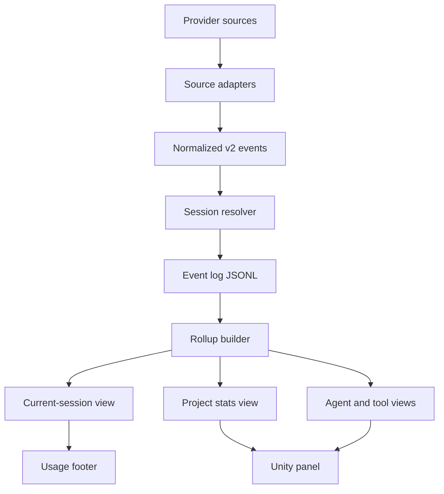

# Usage Analytics V2 Refactor Plan

Status: proposed. Depends on user approval of `docs/design/usage-analytics-v2-gdd.md`.

Goal: replace the current counter-centric usage layer with a session-correct event-sourced analytics layer while preserving existing reports, hooks, and Unity UI during migration.

## Current State

The usage feature already has a useful v1 foundation:

- `scripts/usage-report.ps1` collects lifecycle-hook usage, writes last reports, appends v1 history, and handles Codex logical-session correction.
- `scripts/usage-common.ps1` owns common formatting, prices, JSON helpers, Codex rollout scanning, and token-bucket math.
- `scripts/usage-stats.ps1` aggregates v1 `history.jsonl` into 24h, 7d, and 30d stats.
- `scripts/usage-footer.ps1` renders visible final-response usage.
- `upm/Editor/AgentKitUsagePanel.cs` reads `stats-summary.json` and displays project-level statistics.

The current weakness is not a single bug; it is the data model. Session counters, source offsets, v1 history, footer reports, and project statistics are coupled. That makes it too easy for a provider-level technical session to leak into a user-visible logical session.

## Target Architecture



The source of truth becomes `.agents/usage/v2/events/*.jsonl`. Everything displayed to users is a derived view.

## Data Contracts

### Event Envelope

Every v2 event uses this envelope:

```json
{
  "schemaVersion": 2,
  "eventId": "evt_...",
  "idempotencyKey": "source:path:offset:kind",
  "observedUtc": "2026-07-08T17:39:00Z",
  "source": {
    "platform": "codex",
    "adapter": "rollout",
    "path": "...",
    "offset": 123,
    "confidence": "high"
  },
  "project": {
    "projectId": "prj_...",
    "rootHash": "..."
  },
  "sessionId": "ses_...",
  "traceId": "trc_...",
  "spanId": "spn_...",
  "type": "span.usage",
  "payload": {}
}
```

### Identity Rules

Session identity is resolved in priority order:

1. Explicit product thread/window ID exposed by the client.
2. Provider session ID plus stable logical window metadata.
3. Transcript path plus first user-message timestamp plus cwd hash.
4. Fallback generated session with low confidence.

Trace identity:

- One trace per user-visible turn.
- A trace can contain main model calls, subagent spans, tool spans, hook spans, and scan spans.

Span identity:

- Model call, subagent run, tool call, scan batch, and hook execution are spans.
- `parentSpanId` connects subagent and tool work to the main trace.

### Materialized Views

`current-session.json`:

- Active logical session.
- Turns, user messages, assistant messages, model calls, tool calls, agents.
- Tokens in/out, cache read/write, reasoning tokens where available.
- Estimated cost and price-source completeness.
- Source confidence and warnings.

`session-index.json`:

- Recent sessions by platform and project.
- Started/ended timestamps, title/topic hints, status, totals.

`stats-summary.json`:

- Compatibility fields for current Unity panel.
- v2 additions: tools, source health, confidence, schema version, rebuild watermark.

`agent-summary.json`:

- Role/scope, runs, calls, tokens, cost, duration, success/error counts, last used.

`tool-summary.json`:

- Tool kind/name, calls, failures, duration, last error category, last used.

## Refactor Phases

### Phase 0 - Guardrails and Fixtures

Purpose: make the refactor testable before changing behavior.

Tasks:

- Add replay fixtures for Claude transcript entries, Codex rollout entries, Gemini telemetry entries, corrupt JSON lines, duplicate token events, unpriced models, and session switches.
- Add a scratch replay harness that invokes PowerShell scripts against temporary `.agents/usage/` roots.
- Document expected outputs for v1 and v2 side by side.

Acceptance:

- Fixtures can reproduce the old wrong class of bug: one short Codex task must not inherit 71 historical turns.
- Replay tests run without network and without model calls.
- No production output changes yet.

### Phase 1 - V2 Storage Helpers

Purpose: introduce event storage without touching UI.

Tasks:

- Add `Get-UsageV2Dir`, `New-UsageEvent`, `Add-UsageEvent`, `Get-UsageProjectId`, `Get-UsageStableHash`, and `Get-UsageIdempotencyKey` in `scripts/usage-common.ps1`.
- Write event files by UTC date under `.agents/usage/v2/events/`.
- Add `state/ingestors.json` for source offsets and idempotency watermarks.
- Keep writes atomic or append-only with retry behavior matching `Add-HistoryRecord`.

Acceptance:

- Helpers work on Windows PowerShell 5.1 and pwsh 7.
- Event files are UTF-8 without BOM.
- Duplicate idempotency keys do not double-count after rollup.

### Phase 2 - Session Resolver

Purpose: separate provider technical sessions from user-visible logical sessions.

Tasks:

- Implement `Resolve-UsageLogicalSession`.
- Add platform-specific resolvers:
  - Codex: prefer window/thread IDs, then turn metadata, then rollout file ID.
  - Claude: prefer hook `session_id`, transcript filename, and cwd.
  - Gemini: prefer hook/session metadata and telemetry session IDs.
- Record `confidence` as `high`, `medium`, or `low`.
- Record aliases so footer lookup can resolve by provider ID or logical ID.

Acceptance:

- New Codex chat with one command creates one logical session.
- Reused rollout/provider files do not merge visible session totals.
- Low-confidence fallback is labeled in Health view.

### Phase 3 - Dual Write Adapters

Purpose: emit v2 events while keeping v1 stable.

Tasks:

- Extend `Read-TranscriptUsage`, `Read-CodexTranscriptUsage`, and `Read-GeminiTelemetryUsage` to return normalized event candidates or call event helpers.
- Emit message, span, usage, agent, and source warning events.
- Preserve current `history.jsonl`, `last-report.md`, and `stats-summary.json` behavior.

Acceptance:

- Existing validation still passes.
- v1 and v2 totals match on fixtures where v1 has enough information.
- v2 carries richer agent/tool/session data.

### Phase 4 - V2 Rollup Builder

Purpose: build views from the event log.

Tasks:

- Refactor `usage-stats.ps1` so the aggregation core can read v2 events.
- Generate `v2/views/current-session.json`, `session-index.json`, `stats-summary.json`, `agent-summary.json`, and `tool-summary.json`.
- Add a `-Rebuild` mode that ignores materialized views and reconstructs them from events.
- Add compatibility output so current UI can keep reading `stats-summary.json` during transition.

Acceptance:

- Rollup is deterministic.
- Rebuild after deleting views restores the same totals.
- Unknown event types are skipped with warnings, not fatal errors.

### Phase 5 - Footer Cutover

Purpose: solve the user-visible current-session issue at the right layer.

Tasks:

- Make `usage-footer.ps1` read v2 `current-session.json` first.
- Keep v1 `last-report*.md` fallback for one release.
- Show concise health notes when v2 is stale, missing, partial, or unpriced.

Acceptance:

- Footer always labels current logical session.
- If only v1 exists, footer keeps working and says it used fallback data.
- Final-response tokens remain documented as counted by the next lifecycle report.

### Phase 6 - Unity Panel V2

Purpose: expose the analytics model cleanly.

Tasks:

- Update `AgentKitUsagePanel.cs` parsing models for v2 summary files.
- Add sections or tabs:
  - Current Session
  - Trends
  - Models
  - Agents
  - Tools
  - Health
  - Settings
- Add rebuild button that runs `usage-stats.ps1 -Rebuild`.
- Preserve empty states and warning states.

Acceptance:

- Panel renders with no data, v1-only data, v2 data, and corrupt data.
- UI never parses files every repaint; it reloads on refresh and process completion.
- Health section makes source completeness visible.

### Phase 7 - Migration

Purpose: keep existing user history without poisoning current sessions.

Tasks:

- Add a one-shot migration from v1 `history.jsonl` to v2 `migration.imported` or `span.usage` summary events.
- Mark imported events as historical summary, not active session detail.
- Store migration watermark in `v2/state/migrations.json`.

Acceptance:

- Old 24h/7d/30d project windows survive.
- Imported history does not become the current session.
- Migration is idempotent.

### Phase 8 - Advanced Analytics

Purpose: make the feature useful beyond totals.

Tasks:

- Add budget warnings for per-session and daily spend.
- Add anomaly hints for high cache miss ratio, unpriced models, tool failures, retry loops, and unusually high output.
- Add export to sanitized Markdown/JSON.
- Add optional prompt/output snippets behind explicit config.

Acceptance:

- Warnings are explainable and link to the data source.
- No hard blockers are introduced in V2.
- Privacy defaults remain metadata-only.

## File-Level Plan

Expected durable source edits when implementation starts:

- `scripts/usage-common.ps1`: v2 helpers, hashes, event writes, resolver helpers, pricing reuse.
- `scripts/usage-report.ps1`: dual-write hook events and current-session aliases.
- `scripts/usage-stats.ps1`: v2 rollup and rebuild mode.
- `scripts/usage-footer.ps1`: v2 current-session rendering with v1 fallback.
- `scripts/kit-common.ps1`: install any new scripts.
- `upm/Editor/AgentKitUsagePanel.cs`: v2 UI and health view.
- `upm/Kit~/.agents/scripts/*`: rendered payload after `scripts/render-upm-payload.ps1`.
- `CHANGELOG.md`, `README.md`, `README.ru.md`, `VERSION`, `upm/package.json`: release paperwork when shipping.

## Verification Plan

Run from repo root:

```powershell
powershell -NoProfile -ExecutionPolicy Bypass -File .\scripts\validate-kit.ps1
```

Additional implementation tests:

- Replay fixtures for Codex logical sessions, duplicate token events, and session aliases.
- Replay fixtures for Claude subagents and synthetic entries.
- Rebuild views from event logs and compare stable snapshots.
- Culture test under comma-decimal locale.
- Fresh install test into a scratch Unity project.
- Manual smoke test in Codex desktop, Claude Code, and Gemini where available.

## Risks

| Risk | Mitigation |
|---|---|
| Provider schemas change | Defensive parsing, source warnings, low-confidence labels. |
| Event log grows too large | Retention plus rebuildable summarized imports. |
| JSONL queries become slow | Keep materialized views; consider SQLite only after real measurements. |
| Privacy concerns | Metadata-only default, hashes, opt-in snippets. |
| V1/V2 drift during migration | Fixture replay compares v1 and v2 totals. |
| UI complexity | Add sections incrementally; keep Health visible. |

## Release Strategy

Recommended release split:

1. Release A: schema, fixtures, dual write, rollup views hidden behind v1 UI.
2. Release B: footer cutover and Unity panel V2.
3. Release C: migration cleanup and advanced analytics.

Do not remove v1 fallback until at least one release after v2 footer cutover.
